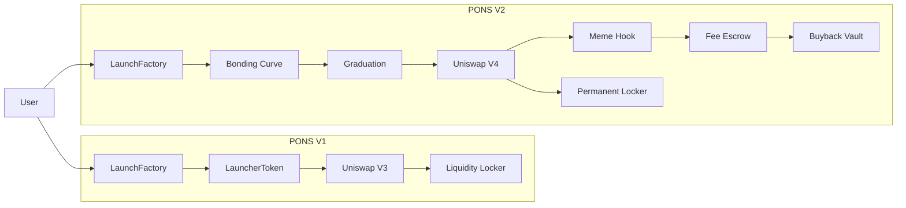

<div align="center">

<br>


<br><br>

# Pons Family

### The native launchpad infrastructure for Robinhood Chain.

<a href="https://ponsfamily.com">
  
</a>

<br>

[](https://ponsfamily.com)
[](#)
[](#)
[](#)
[](#)
[](LICENSE)

<br><br>

<a href="https://x.com/ponsdotfamily">X</a>
  •   <a href="https://ponsfamily.com">Website</a>
  •   <a href="#architecture">Architecture</a>
  •   <a href="#contracts">Contracts</a>

<br><br>

</div>

---

## `01` — Overview

Pons Family is a launchpad protocol built natively for **Robinhood Chain**, providing the on-chain infrastructure required to create, bootstrap, graduate and permanently lock liquidity for new tokens.

The repository contains two generations of the launch architecture:

|                      | V1                   | V2                   |
| -------------------- | -------------------- | -------------------- |
| Launch mechanism     | `CREATE2` Factory    | Bonding Curve        |
| Liquidity            | Uniswap V3           | Uniswap V4           |
| Initial distribution | Full supply → pool   | Full supply → curve  |
| Launch protection    | Anti-snipe limits    | Curve price impact   |
| Graduation           | Capital threshold    | Curve → V4           |
| Liquidity lock       | Locked position NFT  | Permanent lock       |
| Fees                 | Launch configuration | Shared fee policy    |
| Buybacks             | —                    | 5-year vesting vault |

V1 is designed around **atomic launches and deterministic deployment**.

V2 extends the architecture into a complete **bonding-curve → graduation → Uniswap V4** lifecycle with shared fee infrastructure, creator taxation, fee escrow and protocol buybacks.

---

## `02` — Architecture



---

## `03` — Launch Lifecycle

<div align="center">


</div>

### V1

```text
CREATE2
   │
   ▼
TOKEN DEPLOYMENT
   │
   ▼
UNISWAP V3 POSITION
   │
   ▼
LIQUIDITY LOCK
   │
   ▼
LIVE MARKET
```

### V2

```text
TOKEN DEPLOYMENT
        │
        ▼
  BONDING CURVE
        │
        ▼
   GRADUATION
        │
        ▼
UNISWAP V4 POOL
        │
        ▼
PERMANENT LOCK
        │
        ▼
 FEE / BUYBACK SYSTEM
```

---

# `04` — V1

## CREATE2 Launch Factory

V1 provides a single-transaction launch flow built around deterministic token deployment and immediate Uniswap V3 liquidity.

### Core properties

* Deterministic token addresses through `CREATE2`
* Fixed-supply ERC-20 deployment
* Full supply concentrated into a Uniswap V3 position
* Position NFT transferred into a configurable locker
* Optional developer buy executed atomically
* Temporary anti-snipe restrictions
* Per-wallet and cumulative buy caps
* Graduation based on capital actually locked in the pool

### `PonsLaunchFactory.sol`

The factory controls the complete launch configuration:

* DEX profiles
* Uniswap V3 factory
* Nonfungible Position Manager
* Swap Router
* Fee tier
* Tick spacing
* Pair asset
* Token supply
* Anti-snipe windows
* Graduation threshold
* Initial tick
* Developer buy configuration

It also exposes deterministic address prediction through:

```solidity
predictTokenAddress(...)
```

and launch progress through:

```solidity
graduationStatus(...)
```

### V1 contracts

```text
contractsV1/src/

├── PonsLaunchFactory.sol
├── PonsLauncherToken.sol
│
├── interfaces/
│   └── ILaunchpad.sol
│
└── libraries/
    ├── PonsLiquidityMath.sol
    └── PonsTickMath.sol
```

---

# `05` — V2

## Bonding Curve → Uniswap V4

V2 introduces a complete lifecycle for token launches.

Every launch begins with a **constant-product bonding curve** and graduates into a permanently locked, full-range Uniswap V4 pool.

The same quote asset is used throughout the lifecycle.

```text
QUOTE ASSET
     │
     ▼
BONDING CURVE
     │
     │  trading
     ▼
GRADUATION
     │
     ▼
UNISWAP V4
     │
     ├── Hook
     ├── Fee Escrow
     ├── Creator Tax
     └── Buyback Vault
```

### Bonding curve

`PonsV2BondingCurve.sol` manages launch-specific constant-product liquidity.

A phantom quote reserve establishes the opening price while allowing the curve to operate using the same quote asset that will later be used by the V4 pool.

Fees are denominated in the **quote asset**, never in the memecoin leg.

### Fee policy

Each launch snapshots the shared:

```solidity
IPonsV2FeePolicy
```

This provides consistent fee configuration while preserving launch-level immutability.

Creator taxation is supported within protocol-defined caps.

---

## Graduation

V2 graduation is deliberately split into two stages:

```text
graduate()
    │
    ▼
CURVE RESERVES
    │
    ▼
FACTORY
    │
    ▼
createGraduatedPool()
    │
    ▼
UNISWAP V4
```

This separation allows pool creation to be retried safely if deployment or initialization encounters an external failure.

The graduation flow is designed so that curve reserves cannot become stranded between the two stages.

---

# `06` — Uniswap V4 Hook

## `PonsV2MemeHook`

The V2 hook operates on the graduated Uniswap V4 pool.

After swaps, the hook can convert memecoin-denominated fees into quote currency against available pool liquidity.

Conversions are constrained by a configurable maximum price-impact bound.

```text
V4 SWAP
   │
   ▼
afterSwap
   │
   ▼
MEME FEE
   │
   ▼
QUOTE CONVERSION
   │
   ▼
FEE INFRASTRUCTURE
```

---

# `07` — Liquidity Locking

Liquidity is not designed around an administrative withdrawal path.

### V1

The Uniswap V3 position NFT is transferred into the configured locker.

### V2

The graduated Uniswap V4 position is created as a full-range position and permanently locked.

There is **no withdrawal or arbitrary-call escape path** in the V2 locker architecture.

---

# `08` — Buyback Infrastructure

## `PonsV2BuybackVault`

V2 introduces a five-year linear vesting mechanism for protocol buybacks.

The vault uses a **weighted-average vesting clock**, allowing additional deposits to be incorporated without resetting the entire vesting schedule.

```text
PROTOCOL FEES
      │
      ▼
BUYBACK VAULT
      │
      ▼
5 YEAR VESTING
      │
      ▼
BUYBACK CAPITAL
```

Buybacks are treated as vested protocol infrastructure rather than an immediate burn mechanism.

---

# `09` — Fee Escrow

## `PonsV2FeeEscrow`

Fees are claim-based and separated between:

* Protocol balances
* Creator balances
* ETH
* ERC-20 quote assets

The escrow architecture keeps fee accounting independent from the launch and graduation lifecycle.

---

# `10` — Guardrails

V2 enforces protocol-level launch constraints before deployment.

| Parameter           |                Constraint |
| ------------------- | ------------------------: |
| Curve fee           |                     ≤ 10% |
| Creator tax         |                     ≤ 10% |
| Total trade fee     |                     ≤ 20% |
| Pair-token decimals |          Minimum enforced |
| Launch supply       |          Minimum enforced |
| Metadata            |             Length-capped |
| Quotability         | Reference trade preflight |

Metadata caps apply to:

```text
name
symbol
logo
description
socials
```

A quotability preflight verifies that the configured launch can produce a valid reference trade before the lifecycle proceeds.

---

# `11` — Core Contracts

```text
contractsV2/src/v2/

├── PonsV2LaunchFactory.sol
├── PonsV2LaunchDeployer.sol
├── PonsV2BondingCurve.sol
├── PonsV2LauncherToken.sol
│
├── PonsV2GraduationGuard.sol
├── PonsV2GraduationExecutor.sol
├── PonsV2LaunchLocker.sol
├── PonsV2BuybackVault.sol
│
├── hooks/
│   └── PonsV2MemeHook.sol
│
├── interfaces/
│   ├── ILaunchpadV2.sol
│   └── ILaunchpadV2Graduation.sol
│
└── libraries/
    ├── PonsV2BondingCurveMath.sol
    └── PonsV2GraduationMath.sol
```

---

# `12` — Deployed Factories

### V1

```text
PonsLaunchFactory

0xA5aAb3F0c6EeadF30Ef1D3Eb997108E976351feB
```

### V2

```text
PonsV2LaunchFactory

0x7E1EAbd52Ae29598e6483F72dCf1a70b14284dB8
```

Both factory generations are deployed on **Robinhood Chain** with verified source.

---

# `13` — Design Principles

### Deterministic deployment

V1 uses `CREATE2` to make token addresses predictable before deployment.

### Atomic launch

V1 can deploy the token, initialize liquidity and execute the developer buy inside a single transaction.

### Temporary launch protection

Anti-snipe restrictions exist only during the configured early launch window.

### One quote asset

V2 uses the same quote asset across the bonding curve and graduated V4 pool.

### Quote-denominated fees

Protocol fees are accounted for in the quote asset rather than extracting value from the memecoin leg.

### Safe graduation

Curve reserves move through explicit graduation stages designed to avoid stranded liquidity.

### Permanent liquidity

V2 graduated liquidity has no administrative withdrawal mechanism.

### Vesting over burning

Protocol buyback capital is released through a five-year vesting model.

### EIP-170 awareness

V2 deployment is split across factory, deployer, graduation and supporting contracts to remain within the EIP-170 contract size limit.

---

# `14` — Security

The contracts make extensive use of established OpenZeppelin primitives:

```text
Ownable2Step
ReentrancyGuard
SafeERC20
```

Additional protections include:

* Snapshotting of V2 fee policy
* Explicit graduation guards
* Permanent V2 locker design
* No arbitrary calls from the V2 locker
* Bounded price impact during hook conversions
* Launch parameter validation
* Metadata limits
* Preflight quotability checks

`PonsTickMath.sol` retains its applicable GPL-2.0-or-later licensing header.

For deployed verification, compare:

```text
deployed bytecode
        +
verified source
        +
contract-meta.json
```

---

# `15` — Repository

```text
.
├── README.md
├── abi.json
├── contract-meta.json
│
├── media/
│   ├── logo.png
│   └── launch-flow.gif
│
├── contractsV1/
│   ├── src/
│   │   ├── PonsLaunchFactory.sol
│   │   ├── PonsLauncherToken.sol
│   │   ├── interfaces/
│   │   │   └── ILaunchpad.sol
│   │   └── libraries/
│   │       ├── PonsLiquidityMath.sol
│   │       └── PonsTickMath.sol
│   │
│   └── lib/
│       └── openzeppelin-contracts/
│
└── contractsV2/
    ├── src/v2/
    │   ├── PonsV2LaunchFactory.sol
    │   ├── PonsV2LaunchDeployer.sol
    │   ├── PonsV2BondingCurve.sol
    │   ├── PonsV2LauncherToken.sol
    │   ├── PonsV2GraduationGuard.sol
    │   ├── PonsV2GraduationExecutor.sol
    │   ├── PonsV2LaunchLocker.sol
    │   ├── PonsV2BuybackVault.sol
    │   ├── hooks/
    │   │   └── PonsV2MemeHook.sol
    │   ├── interfaces/
    │   │   ├── ILaunchpadV2.sol
    │   │   └── ILaunchpadV2Graduation.sol
    │   └── libraries/
    │       ├── PonsV2BondingCurveMath.sol
    │       └── PonsV2GraduationMath.sol
    │
    └── lib/
        ├── openzeppelin-contracts/
        ├── v4-core/
        ├── v4-periphery/
        └── v4-hooks-public/
```

---

# `16` — Stack

<div align="center">

|      Layer     | Technology           |
| :------------: | :------------------- |
|     Network    | **Robinhood Chain**  |
|    Language    | **Solidity**         |
|     V1 DEX     | **Uniswap V3**       |
|     V2 DEX     | **Uniswap V4**       |
|    Security    | **OpenZeppelin**     |
|    V2 Hooks    | **Uniswap V4 Hooks** |
| Token standard | **ERC-20**           |

</div>

---

# `17` — Dependencies

Pons integrates established protocol infrastructure rather than reimplementing external primitives.

```text
OpenZeppelin
        │
        ├── Ownable2Step
        ├── ReentrancyGuard
        └── SafeERC20

Uniswap V4
        │
        ├── v4-core
        ├── v4-periphery
        └── Permit2

Hooks
        │
        └── v4-hooks-public
```

---

# `18` — Contributing

Contributions are welcome.

Before opening a pull request:

1. Keep protocol invariants explicit.
2. Avoid unnecessary changes to deployment architecture.
3. Include tests for security-sensitive behavior.
4. Preserve upstream licensing requirements.
5. Document any changes affecting launch, graduation or liquidity locking.

---

# `19` — License

This repository is released under the **MIT License**, subject to the individual licensing requirements of vendored dependencies and source files carrying their own license headers.

---

<div align="center">

<br>


### Pons Family

**Launch infrastructure for Robinhood Chain.**

<br>

<a href="https://ponsfamily.com">ponsfamily.com</a>
  •   <a href="https://x.com/ponsdotfamily">@ponsdotfamily</a>

<br><br>

`V1 • CREATE2 • Uniswap V3 • V2 • Bonding Curve • Uniswap V4`

<br><br>

</div>
