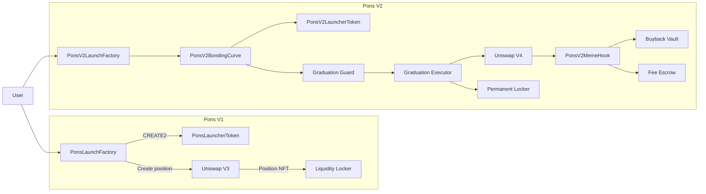

<div align="center">


# Pons Launchpad

### On-chain token infrastructure for Robinhood Chain

**Permissionless launches · Bonding curves · Automated liquidity · Permanent locks**

<br>

<a href="https://ponsfamily.com">
  
</a>

<br><br>

[](LICENSE)
[](#stack)
[](#stack)
[](#v1)
[](#v2)
[](#security)

<br>

<a href="https://ponsfamily.com">Website</a>
 •  <a href="https://x.com/ponsdotfamily">X / Twitter</a>
 •  <a href="#documentation">Documentation</a>

<br><br>


<sub>
CREATE → FUND → TRADE → GRADUATE → LOCK
</sub>

</div>

---

## Overview

**Pons is the native token launch infrastructure of Pons Family, built for Robinhood Chain.**

The protocol provides two generations of permissionless token-launch architecture:

* **V1** — deterministic token deployment with `CREATE2`, one-sided Uniswap V3 liquidity and configurable liquidity locking.
* **V2** — a fair-launch bonding curve that trades directly in the quote asset of its future Uniswap V4 pool, followed by permissionless graduation into a permanently locked full-range position.

The two systems share a common philosophy:

> **Liquidity should be created transparently, fees should be accounted for on-chain, and launched liquidity should not depend on a privileged wallet.**

Both factories are deployed and the corresponding source trees are maintained in this repository.

---

## Protocol at a glance

|                       | V1                    | V2                                        |
| --------------------- | --------------------- | ----------------------------------------- |
| **Launch mechanism**  | CREATE2 factory       | Bonding curve                             |
| **Price discovery**   | Uniswap V3            | Constant-product curve                    |
| **Initial liquidity** | One-sided V3 position | Full supply deposited into curve          |
| **Final venue**       | Uniswap V3            | Uniswap V4                                |
| **Liquidity**         | Concentrated          | Full-range                                |
| **Liquidity lock**    | Configurable locker   | Permanent locker                          |
| **Trading fees**      | V3 pool fee           | Curve + V4 hook                           |
| **Creator revenue**   | Locked-position fees  | Quote-denominated fee share + creator tax |
| **Buybacks**          | —                     | Five-year vesting vault                   |
| **Graduation**        | Position-based status | Permissionless two-phase graduation       |
| **Anti-snipe**        | Launch-window limits  | Curve price impact + reserved allocation  |
| **Dev buy**           | Optional / atomic     | Permissionless                            |

---

# Architecture

Pons is split into two launch architectures.



---

# V1

## CREATE2 factory + locked Uniswap V3 liquidity

V1 is designed around a simple principle:

**launch everything in one transaction.**

Instead of requiring a creator to separately deploy a token, initialize a pool, add liquidity, lock the position and perform an optional first purchase, `PonsLaunchFactory.launchToken()` orchestrates the launch as a single atomic flow.

### Launch flow

```text
                 launchToken(...)
                       │
                       ▼
              ┌─────────────────┐
              │  CREATE2 deploy  │
              │     ERC-20       │
              └────────┬────────┘
                       │
                       ▼
              ┌─────────────────┐
              │ Initialize V3   │
              │      pool       │
              └────────┬────────┘
                       │
                       ▼
              ┌─────────────────┐
              │ Mint concentrated│
              │    liquidity    │
              └────────┬────────┘
                       │
                       ▼
              ┌─────────────────┐
              │  Lock position  │
              │      NFT        │
              └────────┬────────┘
                       │
                       ▼
              ┌─────────────────┐
              │ Optional atomic │
              │    dev buy      │
              └─────────────────┘
```

### Core properties

* **Deterministic deployment** through `CREATE2`
* Predictable token addresses before deployment
* Fixed-supply ERC-20
* One-sided concentrated Uniswap V3 liquidity
* Liquidity position locked through a configurable locker
* Same-block buy protection
* Per-wallet launch-window limits
* Cumulative buy caps
* Optional atomic developer purchase
* Graduation based on **actual locked liquidity principal**

### Core contracts

#### `contractsV1/src/PonsLaunchFactory.sol`

The V1 protocol entry point.

Responsibilities include:

* DEX profile management
* Launch preset management
* Deterministic token deployment
* V3 pool initialization
* Liquidity creation
* Position locking
* Optional atomic developer buy
* Token address prediction
* Graduation status

Key functions:

```solidity
launchToken(...)
predictTokenAddress(...)
graduationStatus(...)
```

---

#### `contractsV1/src/PonsLauncherToken.sol`

The ERC-20 implementation deployed for each V1 launch.

Features:

* Fixed supply
* Factory-controlled initial distribution
* On-chain metadata
* Logo
* Description
* Social links
* Temporary launch-window restrictions

---

#### `contractsV1/src/interfaces/ILaunchpad.sol`

Contains the interfaces required by the launch architecture, including:

* Uniswap V3 factory
* Pool
* Position manager
* Swap router
* Launch records
* Locker hooks

---

#### `contractsV1/src/libraries/`

| Library                 | Purpose                                    |
| ----------------------- | ------------------------------------------ |
| `PonsLiquidityMath.sol` | Concentrated liquidity amount calculations |
| `PonsTickMath.sol`      | Uniswap V3 tick mathematics                |

`PonsTickMath.sol` retains its upstream `GPL-2.0-or-later` licensing.

---

# V2

## Bonding curve → Uniswap V4

V2 is the second-generation launch architecture.

Instead of creating a concentrated liquidity position immediately, every launch begins with a **dedicated constant-product bonding curve**.

The critical design decision is that the curve trades in the **same quote asset used by the eventual V4 pool**.

That means the protocol does not need to:

* swap reserves during graduation,
* rely on an external price oracle,
* route through another pool,
* or introduce an additional price-discovery step.

### V2 lifecycle

```text
        TOKEN CREATED
              │
              ▼
     ┌──────────────────┐
     │  Bonding Curve   │
     │                  │
     │  Token + Quote   │
     └────────┬─────────┘
              │
              │ trades
              ▼
     ┌──────────────────┐
     │ Reserve threshold│
     │     reached      │
     └────────┬─────────┘
              │
              ▼
     ┌──────────────────┐
     │    GRADUATE      │
     │                  │
     │ Drain reserves   │
     └────────┬─────────┘
              │
              ▼
     ┌──────────────────┐
     │ Create V4 pool   │
     │ + full-range LP  │
     └────────┬─────────┘
              │
              ▼
     ┌──────────────────┐
     │ Permanent locker │
     └────────┬─────────┘
              │
              ▼
       UNISWAP V4 MARKET
              │
              ▼
       Shared Pons Hook
```

---

## V2 design principles

### 1. One quote asset end-to-end

The bonding curve and future V4 pool use the same quote asset.

This allows graduation to seed the final pool directly from the curve's reserves.

**No router. No oracle. No intermediate swap.**

---

### 2. Quote-denominated fees

Trading fees are charged on the quote leg.

This means protocol and creator revenue is accumulated in the asset used to trade the pool rather than being left as potentially illiquid memecoin inventory.

---

### 3. Shared fee policy

Fee configuration is governed by a shared `IPonsV2FeePolicy`.

The relevant fee configuration is **snapshotted per launch**, preventing later policy changes from retroactively changing the economics of existing launches.

---

### 4. Permissionless graduation

Graduation is deliberately split into two phases:

```text
graduate()
     │
     ▼
Curve reserves → Factory
     │
     ▼
createGraduatedPool()
     │
     ▼
V4 liquidity position
```

The second phase remains retryable.

This prevents reserves from becoming permanently stranded if V4 pool creation cannot complete on the first attempt.

---

### 5. Permanent liquidity

Graduated V4 liquidity is held by `PonsV2LaunchLocker`.

The locker intentionally exposes:

* no withdrawal path
* no arbitrary-call function
* no `collectFees()` escape hatch

---

### 6. Buybacks are locked, not burned

V2 uses `PonsV2BuybackVault`.

Bought-back supply is held in the vault and released through a **five-year linear vesting mechanism** using a weighted-average vesting clock.

---

# V2 contract architecture

Located under:

```text
contractsV2/src/v2/
```

| Contract                                | Responsibility                                |
| --------------------------------------- | --------------------------------------------- |
| `PonsV2LaunchFactory.sol`               | Launch creation and graduation orchestration  |
| `PonsV2LaunchDeployer.sol`              | Curve/token deployment and metadata bounds    |
| `PonsV2BondingCurve.sol`                | Constant-product pricing, fees and graduation |
| `PonsV2LauncherToken.sol`               | Fixed-supply ERC-20                           |
| `PonsV2GraduationGuard.sol`             | Stateless V4 graduation preflight             |
| `PonsV2GraduationExecutor.sol`          | V4 pool creation and liquidity seeding        |
| `PonsV2LaunchLocker.sol`                | Permanent V4 position custody                 |
| `PonsV2BuybackVault.sol`                | Buyback allocation and five-year vesting      |
| `hooks/PonsV2MemeHook.sol`              | V4 fee collection and fee conversion          |
| `interfaces/ILaunchpadV2.sol`           | V2 protocol interfaces                        |
| `interfaces/ILaunchpadV2Graduation.sol` | Graduation interfaces                         |
| `libraries/PonsV2BondingCurveMath.sol`  | Curve pricing mathematics                     |
| `libraries/PonsV2GraduationMath.sol`    | Graduation calculations                       |

---

# The V2 fee system

V2 separates trading economics into explicit on-chain accounting layers.

```text
                     TRADE
                       │
                       ▼
              ┌─────────────────┐
              │   Quote volume  │
              └────────┬────────┘
                       │
                       ▼
                ┌─────────────┐
                │ Fee policy  │
                └──────┬──────┘
                       │
          ┌────────────┼────────────┐
          ▼            ▼            ▼
      Protocol       Creator      Buyback
        share         share        share
          │            │            │
          └────────────┼────────────┘
                       ▼
                  Fee Escrow
```

The system supports:

* Protocol fees
* Creator fees
* Optional creator tax
* Buyback allocation
* ETH or ERC-20 quote assets
* Claim-based fee accounting

### Protocol limits

V2 enforces:

```text
Curve fee          ≤ 10%
Creator tax        ≤ 10%
Total trade fee    ≤ 20%
```

Additional launch-time guardrails include:

* minimum pair-token decimals
* minimum launch supply
* reference-trade quotability checks
* metadata length limits
* reserved pool allocation constraints

---

# V2 Hook

## `PonsV2MemeHook`

Every graduated V2 pool is governed by the shared singleton hook.

The hook:

1. Takes the configured `afterSwap` fee
2. Detects memecoin-denominated fee inventory
3. Converts it back into the pool's quote asset
4. Enforces a configurable maximum price-impact bound
5. Splits proceeds between protocol, creator and buyback accounting

This allows the post-graduation fee model to remain aligned with the economics established on the bonding curve.

---

# Graduation safety

Graduation is one of the most sensitive operations in V2.

The architecture therefore separates **validation** from **execution**.

```text
PonsV2GraduationGuard
          │
          │ preflight
          ▼
    Can V4 accept it?
          │
       ┌──┴──┐
       │     │
      YES    NO
       │     │
       ▼     ▼
 Executor   Reject
```

`PonsV2GraduationGuard` mirrors the relevant V4 rejection conditions before the curve is drained.

The executor then performs the expensive graduation sequence:

* optional `pairToken` conversion
* Permit2 authorization flow
* V4 position mint
* full-range liquidity creation
* dust handling

The separation also keeps individual contracts within the EIP-170 bytecode limit.

---

# Deployed contracts

## Production factories

| Version | Contract              | Address                                      |
| ------- | --------------------- | -------------------------------------------- |
| **V1**  | `PonsLaunchFactory`   | `0xA5aAb3F0c6EeadF30Ef1D3Eb997108E976351feB` |
| **V2**  | `PonsV2LaunchFactory` | `0x7E1EAbd52Ae29598e6483F72dCf1a70b14284dB8` |

> **Always verify deployed bytecode against the verified source before interacting with a production address.**

The repository also contains deployment metadata for V1:

```text
abi.json
contract-meta.json
```

---

# Stack

| Layer                     | Technology                          |
| ------------------------- | ----------------------------------- |
| **Network**               | Robinhood Chain                     |
| **Execution**             | EVM                                 |
| **Language**              | Solidity `^0.8.26` / `^0.8.30`      |
| **V1 liquidity**          | Uniswap V3                          |
| **V2 liquidity**          | Uniswap V4                          |
| **V2 periphery**          | Uniswap V4 Periphery + Permit2      |
| **Access control**        | OpenZeppelin `Ownable2Step`         |
| **Reentrancy protection** | OpenZeppelin `ReentrancyGuard`      |
| **Token transfers**       | OpenZeppelin `SafeERC20`            |
| **Deployment**            | CREATE2 (V1)                        |
| **Pricing**               | Constant-product bonding curve (V2) |

---

# Repository layout

```text
.
├── README.md
├── abi.json
├── contract-meta.json
│
├── media/
│   ├── logo.png
│   └── launch-flow.gif
│
├── contractsV1/
│   ├── src/
│   │   ├── PonsLaunchFactory.sol
│   │   ├── PonsLauncherToken.sol
│   │   ├── interfaces/
│   │   │   └── ILaunchpad.sol
│   │   └── libraries/
│   │       ├── PonsLiquidityMath.sol
│   │       └── PonsTickMath.sol
│   │
│   └── lib/
│       └── openzeppelin-contracts/
│
└── contractsV2/
    ├── src/
    │   └── v2/
    │       ├── PonsV2LaunchFactory.sol
    │       ├── PonsV2LaunchDeployer.sol
    │       ├── PonsV2BondingCurve.sol
    │       ├── PonsV2LauncherToken.sol
    │       ├── PonsV2GraduationGuard.sol
    │       ├── PonsV2GraduationExecutor.sol
    │       ├── PonsV2LaunchLocker.sol
    │       ├── PonsV2BuybackVault.sol
    │       │
    │       ├── hooks/
    │       │   └── PonsV2MemeHook.sol
    │       │
    │       ├── interfaces/
    │       │   ├── ILaunchpadV2.sol
    │       │   └── ILaunchpadV2Graduation.sol
    │       │
    │       └── libraries/
    │           ├── PonsV2BondingCurveMath.sol
    │           └── PonsV2GraduationMath.sol
    │
    └── lib/
        ├── openzeppelin-contracts/
        ├── v4-core/
        ├── v4-periphery/
        └── v4-hooks-public/
```

---

# Vendor dependencies

The repository vendors the upstream source required to compile and verify the protocol.

### OpenZeppelin

Used for:

* `Ownable`
* `Ownable2Step`
* `ERC20`
* `ERC20Burnable`
* `SafeERC20`
* `ReentrancyGuard`
* Math utilities
* Introspection utilities

### Uniswap V3

Used by V1 for:

* V3 factory
* pools
* position management
* tick mathematics
* concentrated liquidity

### Uniswap V4

Used by V2 for:

* `IPoolManager`
* hooks
* positions
* ticks
* `PoolKey`
* `Currency`
* `BalanceDelta`
* liquidity mathematics

### Uniswap V4 Periphery + Permit2

Used by the V2 graduation executor for:

* position management
* liquidity actions
* `LiquidityAmounts`
* Permit2 authorization

---

# Design principles

### Atomicity

Where practical, protocol-critical launch operations are grouped into atomic transactions.

### Deterministic deployment

V1 uses `CREATE2` to make token addresses predictable before deployment.

### No privileged liquidity custody

Liquidity positions are held by dedicated lockers rather than ordinary creator wallets.

### Quote-native accounting

V2's curve and final pool share the same quote asset.

### Retryable graduation

V2 does not permanently consume curve reserves merely because a single pool-seeding attempt fails.

### Immutable economic history

Fee configuration is snapshotted per V2 launch.

### Permanent liquidity

Graduated liquidity cannot be withdrawn through the Pons lockers.

### Bytecode-aware architecture

V2 deliberately separates deployment, validation and graduation execution to remain within EIP-170 constraints.

---

# Security

Pons is designed with explicit security boundaries around launch, trading and liquidity custody.

### Access control

Ownership transfers use OpenZeppelin `Ownable2Step`.

### Reentrancy

Launch and trading entry points use `ReentrancyGuard` where required.

### Token safety

ERC-20 transfers use OpenZeppelin `SafeERC20`.

### Fee isolation

V2 fee policy is snapshotted for every launch.

Existing launches therefore cannot have their economics retroactively modified by a future policy update.

### Permanent locker

`PonsV2LaunchLocker` intentionally provides:

* no withdrawal function
* no arbitrary external call mechanism
* no fee-collection escape route

### Graduation protection

V2 uses a dedicated preflight guard before draining bonding-curve reserves into the graduation process.

### Source verification

This repository ships source code and deployment metadata.

**Always compare deployed bytecode against the verified source and compiler metadata before trusting a deployed address.**

---

## Security disclosures

If you discover a potential vulnerability, **do not disclose exploit details publicly through a GitHub issue.**

Please contact the Pons Family team privately through the official website.

<a href="https://ponsfamily.com">ponsfamily.com</a>

---

# Generated deployment files

### `abi.json`

ABI for the deployed V1 factory.

### `contract-meta.json`

Deployment metadata including:

* compiler version
* optimizer configuration
* EVM target
* source list

These files are intended to make deployed-source verification reproducible.

---

# Contributing

Issues and pull requests are welcome.

Before submitting a contribution:

1. Review the relevant V1/V2 architecture.
2. Preserve existing SPDX headers.
3. Avoid modifying vendored upstream licenses.
4. Include tests for protocol-level changes.
5. Verify that changes do not introduce a new privileged path around liquidity custody or fee accounting.

---

# License

### First-party Pons contracts

**MIT**

See SPDX headers in the individual source files.

### Uniswap V3 tick mathematics

`PonsTickMath.sol`

**GPL-2.0-or-later**

### OpenZeppelin

**MIT**

### Uniswap V4 / Permit2

Upstream licenses apply on a per-file basis, including MIT, GPL and BUSL where applicable.

---

<div align="center">

<br>


### Pons Family

**The launch infrastructure built for Robinhood Chain.**

<br>

<a href="https://ponsfamily.com">ponsfamily.com</a>
 •  <a href="https://x.com/ponsdotfamily">@ponsdotfamily</a>

<br><br>

<sub>Build. Launch. Trade. Graduate.</sub>

<br><br>


</div>
