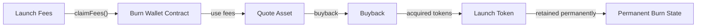
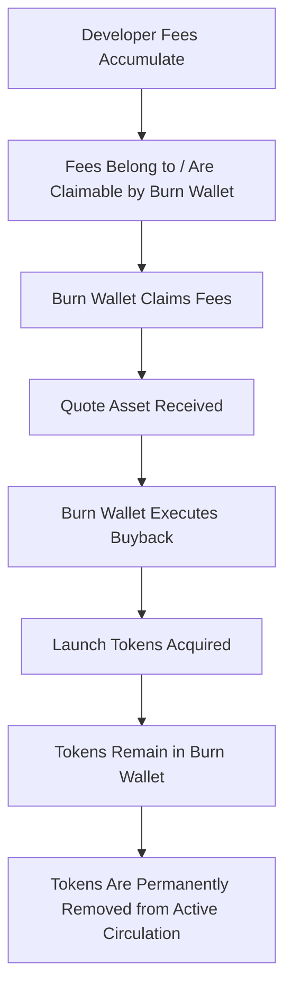
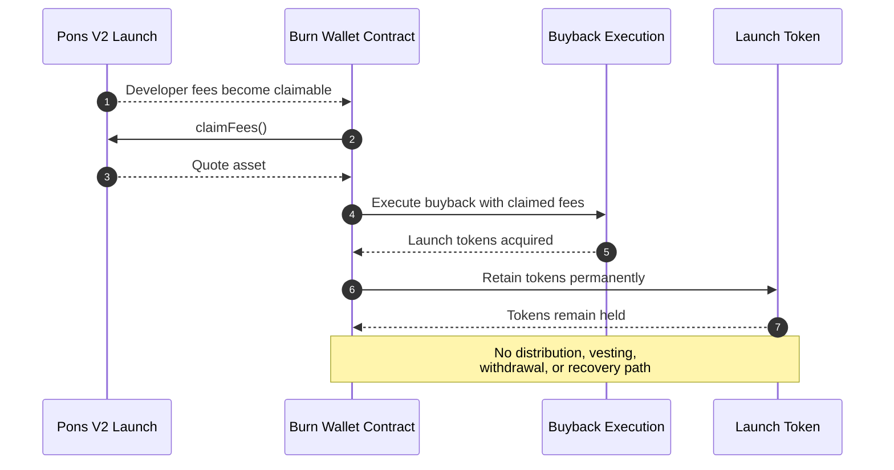
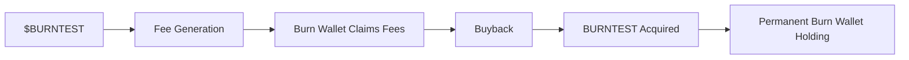
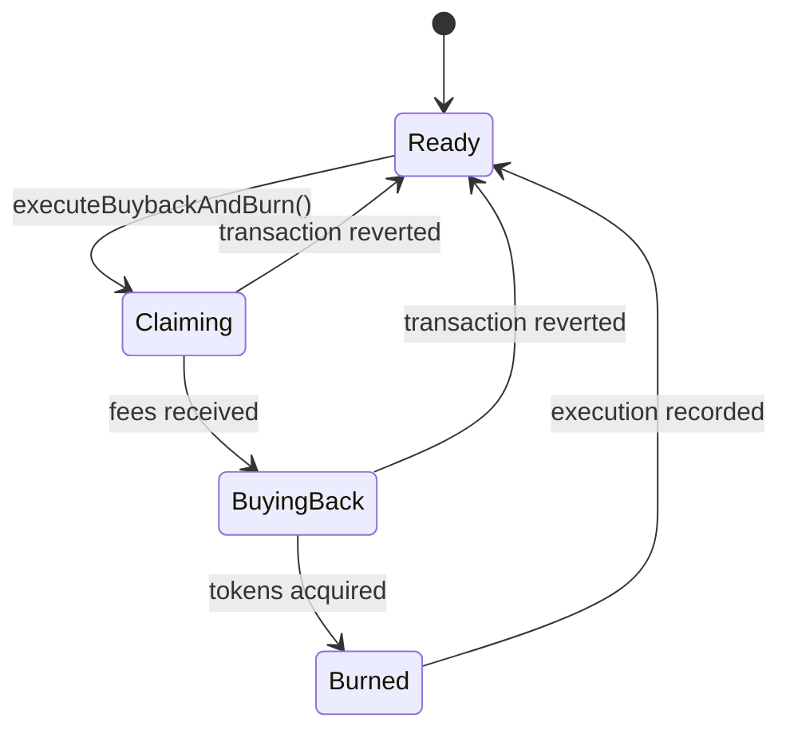
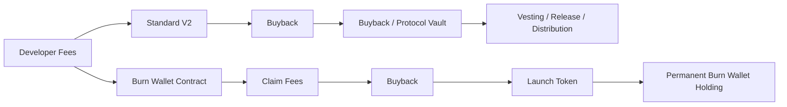
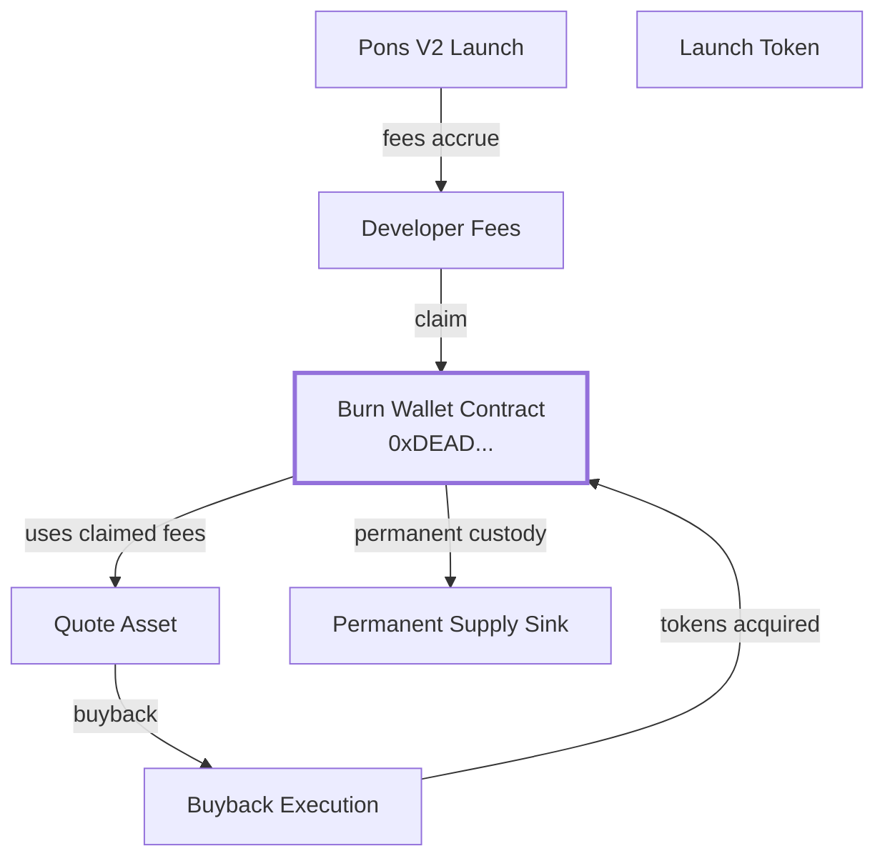

# Pons V2 — Burn Mode

<div align="center" style="margin-bottom: 3rem; animation: float 4s ease-in-out infinite;">
  
</div>

<div class="status-box">
  <div><strong>Reference asset:</strong> Burning Pons (<code>$BURNTEST</code>)</div>
</div>

## 1. Overview

Pons V2 Burn Mode is an experimental extension of the Pons V2 economic architecture designed around a simple principle:

> **The burn wallet contract itself receives and claims the fees, uses those fees to buy back the launch token, and permanently removes the purchased tokens from circulation.**

The burn wallet is not merely a destination address.

It is the **economic executor of the burn mechanism**.

Once configured as the fee recipient, the burn wallet contract can claim the fees generated by the launch, use the received quote asset to execute a buyback, and retain the acquired launch tokens permanently. There is no subsequent distribution, vesting, creator allocation, or recovery path for the bought-back tokens.

The complete lifecycle is:

```text
Developer Fees
      │
      ▼
Burn Wallet Contract
      │
      │ claim fees
      ▼
Quote Asset
      │
      │ buyback
      ▼
Launch Token
      │
      ▼
Burn Wallet Contract
      │
      ▼
Permanent Supply Removal
```

The key architectural distinction is that **the burn wallet contract is both the fee recipient and the final holder of the purchased tokens**.

---

## 2. Design Objective

The design is based on a single economic rule:

> **100% of the fees routed to Burn Mode are used by the burn wallet contract for buybacks, and the tokens acquired by those buybacks remain permanently locked in the burn wallet contract.**

This creates a closed economic loop:

```text
Fees generated by the launch
            │
            ▼
   Claimed by burn wallet
            │
            ▼
       Buyback executed
            │
            ▼
   Launch tokens acquired
            │
            ▼
 Held permanently by burn wallet
            │
            ▼
   No active circulation
```

The mechanism therefore does not introduce:

- a new bonding curve
- a new liquidity model
- a separate vesting system
- a token distribution mechanism
- a creator payout mechanism
- a conventional buyback vault

Instead, the burn wallet contract directly performs the fee-to-buyback-to-burn flow.

---

## 3. Core Economic Model

The most important part of Burn Mode is the ownership flow.

In a standard configuration, fees may ultimately support a vault, creator, vesting mechanism, or other protocol-defined destination.

Burn Mode changes the destination of that economic value:



The burn wallet therefore sits at the center of the mechanism.

There is no intermediary controller that first receives the fees and later forwards the purchased tokens to the burn wallet.

**The burn wallet itself executes the complete economic operation.**

---

## 4. Protocol Lifecycle

A complete Burn Mode execution follows this sequence:



Each completed cycle converts protocol-generated fees into permanent buy-side pressure and then removes the acquired launch tokens from active circulation.

---

## 5. Execution Sequence

The following sequence illustrates the complete fee-to-buyback-to-burn flow.



The operation is designed to be atomic where the underlying fee-claim and buyback integrations support atomic execution.

If a required operation reverts, the transaction reverts and the incomplete cycle is not recorded as a successful burn execution.

---

## 6. Burn Wallet Contract

The burn wallet is the core component of the architecture.

```text
                         BURN WALLET CONTRACT
                                  │
                 ┌────────────────┼────────────────┐
                 │                │                │
                 ▼                ▼                ▼
            Claim Fees       Execute Buyback   Hold Tokens
                 │                │                │
                 ▼                ▼                ▼
            Quote Asset      Launch Tokens    Permanent State
```

The contract has three fundamental responsibilities:

| Responsibility | Description |
|---|---|
| Fee Claiming | Claims the fees routed to the Burn Mode configuration |
| Buyback Execution | Uses the claimed quote asset to purchase the launch token |
| Permanent Custody | Holds the purchased launch tokens with no active distribution path |

The burn wallet is therefore not an ordinary externally owned address.

It is an on-chain contract whose behavior defines the burn mechanism.

---

## 7. Burn Wallet Address

The prototype uses the following fixed burn wallet contract:

```text
0xDEAD83a9C5bCBaECe8300BEC83E85f25B2d0273F
```

It is represented in the implementation as:

```solidity
address public constant BURN_WALLET =
    0xDEAD83a9C5bCBaECe8300BEC83E85f25B2d0273F;
```

The address is intentionally fixed.

The architecture does not rely on an administrator manually moving tokens to this address after each buyback. The burn wallet contract itself is the actor that receives the fees, executes the buyback, and becomes the permanent holder of the purchased tokens.

---

## 8. What "Burned" Means

Burn Mode does not require the launch token to implement `ERC20Burnable`.

Instead, the economic burn is achieved by making the burn wallet contract the permanent holder of the acquired tokens.

The important property is not the presence of a special ERC-20 `burn()` function.

The important property is that the purchased tokens **cannot return to active circulation through the Burn Mode mechanism**.

Conceptually:

```text
             Buyback
                │
                ▼
        Launch Tokens
                │
                ▼
      Burn Wallet Contract
                │
        ┌───────┴───────┐
        │               │
        ▼               ▼
   No distribution   No recovery
        │               │
        └───────┬───────┘
                ▼
       Permanent removal
       from active supply
```

For this reason, Burn Mode treats the burn wallet as a **permanent supply sink** rather than simply a transfer destination.

---

## 9. Test Asset

**Burning Pons — `$BURNTEST`**

The prototype uses a dedicated test asset:

- **Name:** Burning Pons
- **Symbol:** BURNTEST
- **Classification:** Test Token
- **Purpose:** Burn Mode validation
- **Production utility:** None

`$BURNTEST` exists to provide a concrete asset against which the fee-claim and buyback lifecycle can be tested.



---

## 10. Fee Claiming

The Burn Wallet contract is the fee claimant.

The fee source is abstracted through the protocol's fee interface:

```solidity
interface IPonsBurnFeeSource {
    function claimFees() external returns (uint256 amount);
    function quoteToken() external view returns (address);
    function token() external view returns (address);
}
```

The critical architectural property is the caller:

```text
Fee Source
    │
    │ claimFees()
    ▼
Burn Wallet Contract
```

The fees are therefore not first claimed by a separate Burn Mode controller and then forwarded.

**The burn wallet contract directly claims the fees.**

The implementation can measure the quote-token balance before and after the claim to determine the exact amount received and record the corresponding accounting value.

---

## 11. Buyback Execution

After claiming the fees, the Burn Wallet contract uses the received quote asset to execute the buyback.

```text
Burn Wallet Contract
        │
        │ claimed fees
        ▼
   Quote Asset
        │
        │ buyback
        ▼
   Launch Token
        │
        ▼
Burn Wallet Contract
```

The buyback mechanism may be abstracted behind a router or execution adapter, but the economic owner of the operation remains the Burn Wallet contract.

The controller does not send the acquired tokens elsewhere after the buyback.

The tokens end up in the burn wallet contract itself.

---

## 12. Slippage Protection

Every buyback should enforce a minimum acceptable token output.

Conceptually:

```solidity
require(
    actualTokenOutput >= minTokenOut,
    "INSUFFICIENT_OUTPUT"
);
```

This prevents the Burn Wallet contract from executing a buyback at an unexpectedly unfavorable execution price.

The `minTokenOut` parameter therefore protects the fee-funded buyback from excessive slippage.

---

## 13. Allowance Management

When an external router is used, the Burn Wallet contract grants the router access only to the quote-token amount required for the current buyback.

```solidity
IERC20(quoteToken).forceApprove(
    buybackRouter,
    quoteAmount
);
```

After the buyback:

```solidity
IERC20(quoteToken).forceApprove(
    buybackRouter,
    0
);
```

This keeps the approval surface limited to the current execution.

The router receives spending authority over the quote asset, not ownership of the launch tokens after the buyback.

---

## 14. Permanent Burn State

The defining step occurs after the buyback.

The purchased launch tokens are held by the Burn Wallet contract:

```solidity
uint256 amount = IERC20(token).balanceOf(
    address(this)
);
```

The critical architectural property is what **does not happen next**.

There is no:

```text
transfer to creator
transfer to treasury
transfer to vesting vault
transfer to distributor
withdraw()
recoverTokens()
```

Instead, the acquired tokens remain in the Burn Wallet contract.

```text
BUYBACK
   │
   ▼
Launch Tokens
   │
   ▼
BURN WALLET CONTRACT
   │
   ├── No creator distribution
   ├── No vesting release
   ├── No treasury transfer
   ├── No token recovery
   └── No return to active circulation
```

This permanent custody is the burn mechanism.

---

## 15. Complete Pipeline

The primary execution path can be represented as:

```text
┌──────────────────────────────────────────────────┐
│              BURN WALLET EXECUTION               │
├──────────────────────────────────────────────────┤
│  1. Verify Burn Mode configuration               │
│  2. Record quote-token balance                   │
│  3. Claim developer fees                         │
│  4. Determine actual fees received               │
│  5. Approve buyback execution                     │
│  6. Execute launch-token buyback                 │
│  7. Verify minimum token output                  │
│  8. Reset router allowance                       │
│  9. Account for acquired launch tokens           │
│ 10. Retain tokens in Burn Wallet contract       │
│ 11. Update burn accounting                      │
│ 12. Emit execution events                       │
└──────────────────────────────────────────────────┘
```

There is no final transfer into the burn wallet because **the burn wallet is already the holder of the acquired tokens**.

---

## 16. State Model

Burn Mode can be understood as a deterministic execution state machine:



The terminal economic state of each successful cycle is the Burn Wallet's permanent token balance.

---

## 17. Accounting

The prototype can expose the following principal accounting variables:

- `totalFeesClaimed` — cumulative quote asset claimed by the Burn Wallet.
- `totalQuoteSpent` — cumulative quote asset used for buybacks.
- `totalBurned` — cumulative launch tokens permanently retained by the Burn Wallet.
- `executionCount` — number of completed buyback-and-burn executions.

The accounting describes the complete conversion:

```text
Fees Claimed
      ↓
Quote Spent
      ↓
Tokens Acquired
      ↓
Tokens Permanently Burned
```

---

## 18. Events

The contract should expose explicit events for the major economic stages.

Example event categories include:

```text
FeesClaimed
BuybackExecuted
TokensBurned
BuybackAndBurnExecuted
```

A completed event sequence makes each fee-funded burn cycle independently observable on-chain.

---

## 19. Access Control

The Burn Wallet contract should not rely on a privileged operator to manually move purchased tokens into a second burn address.

The permanent custody rule is part of the mechanism itself.

Any administrative configuration must not create a backdoor through which already-burned tokens can be withdrawn or redistributed.

In particular, the architecture should ensure that there is no privileged path for:

```text
Burned token
     │
     ├──> Creator
     ├──> Treasury
     ├──> Deployer
     └──> Arbitrary recipient
```

The intended invariant is:

> **Once launch tokens are acquired by the Burn Wallet through the Burn Mode buyback, they remain there permanently.**

---

## 20. Reentrancy Protection

State-changing execution functions should be protected with `nonReentrant`.

This is particularly important because the execution path interacts with external contracts:

```text
Fee Source
     ↓
Burn Wallet
     ↓
Buyback Router
     ↓
Token / Liquidity
```

The contract should maintain strict state accounting around these external calls.

---

## 21. Failure Semantics

The fee claim and buyback sequence should be atomic wherever the underlying integrations permit it.

If a required step fails:

```text
Claim
  ↓
Buyback
  ↓
Accounting
```

the incomplete transaction reverts rather than leaving the protocol in a partially executed state.

A failed buyback therefore does not constitute a successful burn execution.

---

## 22. Contract Interface

A conceptual interface may expose the following functions:

| Function | Access | Purpose |
|---|---|---|
| `claimFees()` | Public / protocol-defined | Claim fees into the Burn Wallet |
| `quoteBuyback()` | View | Estimate buyback output |
| `executeBuyback()` | Public / protocol-defined | Execute the buyback |
| `executeBuybackAndBurn()` | Public / protocol-defined | Claim fees, buy back tokens, and permanently retain them |
| `burnedBalance()` | View | Read tokens permanently held by the Burn Wallet |

The exact interface depends on the final production integration.

---

## 23. Separation of Responsibilities

The architecture separates infrastructure responsibilities while keeping the economic authority in the Burn Wallet contract.

| Component | Responsibility |
|---|---|
| Pons V2 Launch | Generates developer fees |
| Fee Source | Holds / exposes claimable fees |
| Burn Wallet Contract | Claims fees and controls the Burn Mode execution |
| Buyback Router | Executes the market purchase |
| Launch Token | Token being purchased |
| Burn Wallet Balance | Permanent destination of purchased tokens |

The distinction is important:

**The router executes the trade. The Burn Wallet owns the economic result.**

---

## 24. Standard V2 vs Burn Mode

The economic difference can be represented as follows:



Standard V2 can preserve an economic value flow toward a vault or release mechanism.

Burn Mode terminates the value flow in the Burn Wallet.

The bought-back tokens are not subsequently released.

---

## 25. The Burn Loop

The entire mechanism can be reduced to one loop:

```text
        ┌──────────────────────────┐
        │                          │
        ▼                          │
  Developer Fees                  │
        │                          │
        ▼                          │
 Burn Wallet Claims Fees           │
        │                          │
        ▼                          │
     Buyback                       │
        │                          │
        ▼                          │
 Launch Tokens Acquired            │
        │                          │
        ▼                          │
 Permanent Burn Wallet Holding     │
        │                          │
        └────── Supply Removed ────┘
```

The loop is deliberately simple:

**fees → buyback → permanent token removal**

---

## 26. Key Invariants

The architecture is built around several core invariants.

### Invariant 1 — Fees Fund the Buyback

Fees routed to Burn Mode are intended to fund the corresponding buyback operation.

### Invariant 2 — Burn Wallet Is the Executor

The Burn Wallet contract itself claims the fees and controls the resulting buyback flow.

### Invariant 3 — Buyback Tokens Stay in the Burn Wallet

Purchased launch tokens are not forwarded to a secondary vault, creator, treasury, or distributor.

### Invariant 4 — No Recovery Path

Already-burned tokens cannot be recovered through an administrative token-rescue mechanism.

### Invariant 5 — No Secondary Distribution

The Burn Mode architecture does not contain a vesting or release phase for purchased tokens.

### Invariant 6 — Observable On-Chain

Fee claims, buybacks, token balances, and execution events remain independently observable on-chain.

---

## 27. Security Considerations

The most important security property is the permanence of the token sink.

A production implementation should be reviewed specifically for:

- privileged token withdrawal
- upgradeable implementation risks
- owner-controlled destination changes
- malicious fee-source behavior
- buyback router approval risks
- arbitrary external-call execution
- slippage configuration
- reentrancy
- token compatibility
- fee accounting discrepancies
- unexpected token transfers into the Burn Wallet
- upgrade paths that could introduce token recovery

The intended security invariant is straightforward:

> **No privileged actor should be able to turn the Burn Wallet into a recoverable token vault after tokens have been acquired through Burn Mode.**

---

## 28. Atomicity

The ideal production execution is a single transaction:

```text
CLAIM
  │
  ▼
BUYBACK
  │
  ▼
PERMANENT HOLD
  │
  ▼
ACCOUNT
```

This prevents the protocol from depending on a separate keeper transaction to move purchased tokens to a burn destination.

The Burn Wallet is already the destination.

---

## 29. No Manual Burn Operation

A major architectural consequence is that a separate `burn()` transfer is unnecessary.

An older model might look like:

```text
Controller
    │
    ├── claim fees
    ├── buyback
    └── transfer tokens → Burn Wallet
```

Burn Mode instead works as:

```text
Burn Wallet Contract
    │
    ├── claim fees
    ├── buyback
    └── retain tokens permanently
```

This removes an entire transfer step from the economic architecture.

---

## 30. Supply Effect

The supply effect comes from the fact that fees are converted into the launch token and those purchased tokens are permanently removed from active circulation.

Conceptually:

```text
Fees
  ↓
Market Buy
  ↓
Launch Tokens Removed from Circulation
```

The mechanism therefore creates a direct relationship between fee generation and permanent token accumulation by the burn sink.

The exact reduction in circulating supply depends on the amount of fees generated, buyback execution price, token liquidity, and the token's broader supply mechanics.

---

## 31. Test Sequence

A basic validation sequence is:

```text
1. Deploy / configure the Burn Wallet contract
2. Configure the launch to route fees to the Burn Wallet
3. Generate developer fees
4. Confirm fees are claimable
5. Execute the fee claim
6. Confirm quote asset balance increased
7. Execute the buyback
8. Confirm launch tokens were acquired
9. Confirm tokens remain held by the Burn Wallet
10. Confirm no recovery / distribution path exists
11. Confirm accounting and events
12. Repeat with another fee cycle
```

The expected result after every successful cycle is:

```text
Burn Wallet quote balance
        ↓
       Buyback
        ↓
Burn Wallet launch-token balance ↑
        ↓
No release
No redistribution
No recovery
```

---

## 32. Repository Structure

A production repository can separate the mechanism into clear modules:

```text
src/
├── PonsV2BurnWallet.sol
├── interfaces/
│   ├── IPonsBurnFeeSource.sol
│   └── IPonsBurnBuybackRouter.sol
├── libraries/
└── mocks/

test/
├── BurnWallet.t.sol
├── FeeClaim.t.sol
├── Buyback.t.sol
├── PermanentBurn.t.sol
├── Invariants.t.sol
└── Security.t.sol

script/
└── DeployBurnWallet.s.sol
```

The naming should reflect the actual architecture: the primary contract is the **Burn Wallet**, not a separate controller that later transfers tokens to it.

---

## 33. Deployment Configuration

A deployment configuration should define the immutable economic dependencies required by the Burn Wallet:

| Parameter | Purpose |
|---|---|
| `feeSource` | Source of claimable developer fees |
| `quoteToken` | Asset used for the buyback |
| `token` | Launch token being purchased |
| `buybackRouter` | Buyback execution infrastructure |
| `BURN_WALLET` | Fixed Burn Wallet contract address |

The Burn Wallet address should not be replaceable after deployment if permanence is a core protocol guarantee.

---

## 34. Implementation Status

The `$BURNTEST` implementation is intended as a reference architecture for validating the Burn Mode mechanism.

The production integration should independently verify:

- fee routing
- fee claiming permissions
- buyback execution
- token custody
- permanent token retention
- upgradeability assumptions
- access control
- slippage protection
- accounting
- event correctness
- invariant enforcement

No production deployment should be inferred solely from this reference implementation.

---

## 35. Economic Summary

Burn Mode transforms developer fees into a permanent token sink.

```text
Developer Fees
       │
       ▼
Burn Wallet Contract
       │
       ├── Claim
       │
       ▼
Quote Asset
       │
       ├── Buyback
       │
       ▼
Launch Token
       │
       ▼
Burn Wallet Contract
       │
       ▼
Permanent Removal
```

There is no intermediate treasury.

There is no vesting period.

There is no creator distribution.

There is no manual transfer into a second burn address.

**The contract that receives the fees is the contract that executes the buyback and permanently holds the tokens.**

---

## 36. Reference Architecture

The complete architecture can be summarized in one diagram:



The Burn Wallet is the center of the economic loop.

---

## 37. Final Principle

> **Burn Mode does not send bought-back tokens to a burn wallet. The Burn Wallet itself performs the buyback and becomes the permanent home of the purchased tokens.**

That distinction is the foundation of the architecture.

The intended lifecycle is therefore:

```text
FEES
  ↓
CLAIMED BY BURN WALLET
  ↓
USED FOR BUYBACK
  ↓
LAUNCH TOKENS ACQUIRED
  ↓
HELD PERMANENTLY BY BURN WALLET
  ↓
REMOVED FROM ACTIVE CIRCULATION
```

<br><br>

<div align="center" style="margin-top: 3rem; padding-top: 2rem; border-top: 1px solid #30363d;">
  <p style="color: #6e7681; font-size: 0.9rem;">
    <em>This contract is released under the license specified by the repository. For production deployment, independent security review and protocol-level integration testing are required.</em>
  </p>
</div>
