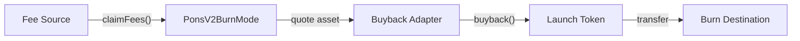
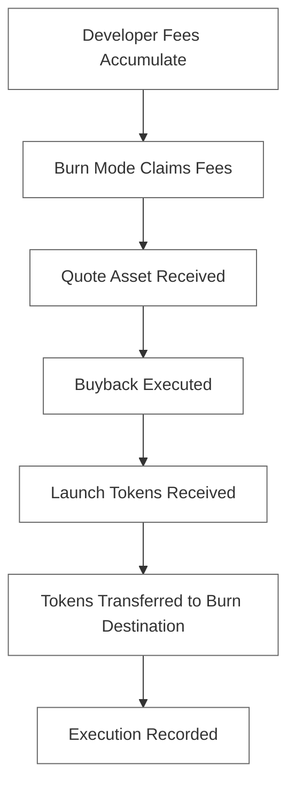
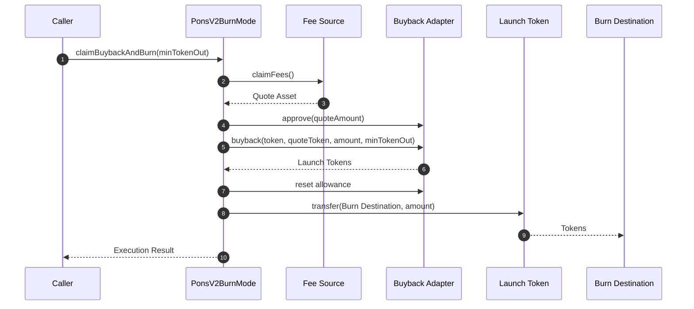
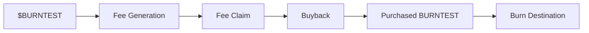
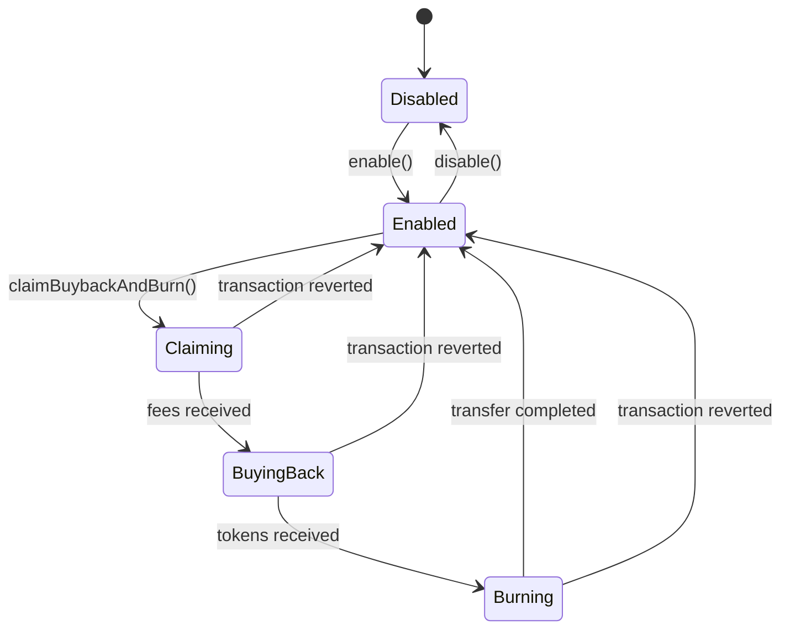
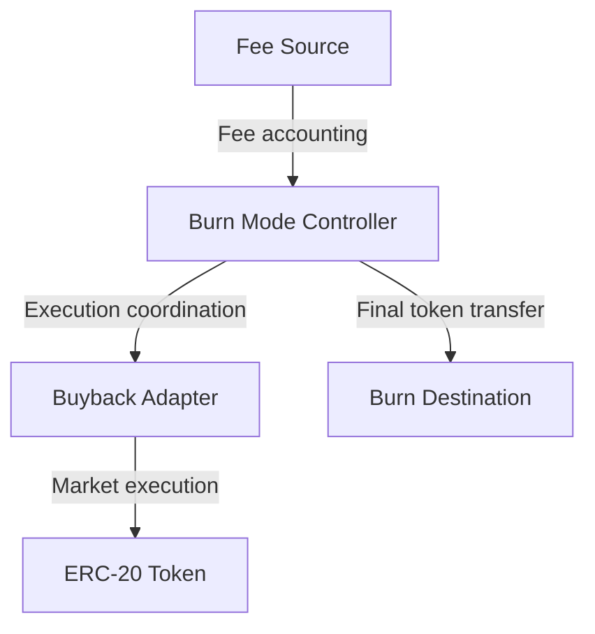
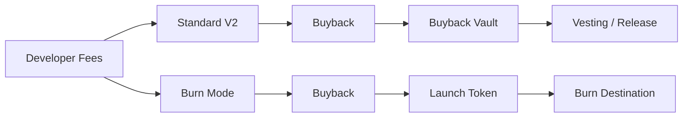
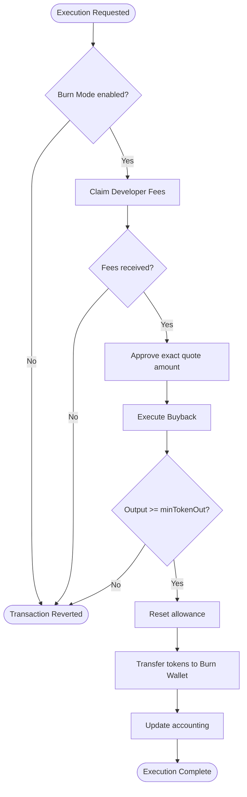

# Pons V2 — Burn Mode

<p align="center">
  
</p>

<p align="center">
  <strong>Experimental protocol extension for Pons V2</strong>
</p>

<p align="center">
  <code>FEES → CLAIM → BUYBACK → TOKEN ACQUISITION → BURN DESTINATION</code>
</p>

<br>

> **Status:** Experimental Proposal
> **Implementation:** Standalone Solidity prototype
> **Production integration:** Not integrated
> **Audit status:** Not audited
> **Reference asset:** Burning Pons (`$BURNTEST`)

---

## 1. Overview

**Pons V2 Burn Mode** is an experimental extension proposal for the Pons V2 economic architecture.

The mechanism introduces an alternative destination for developer fees generated by a launch.

Instead of allowing the resulting bought-back tokens to enter a conventional vesting or distribution mechanism, Burn Mode routes the economic flow toward a designated, immutable burn destination.

The complete lifecycle is:

```text
Developer Fees
      │
      ▼
Fee Claim
      │
      ▼
Quote Asset
      │
      ▼
Buyback
      │
      ▼
Launch Token
      │
      ▼
Immutable Burn Destination
```

The prototype is deliberately isolated from the existing production V2 contracts.

Its purpose is to establish and test the **economic and technical primitives** required for a potential native implementation.

---

## 2. Design Objective

The proposal is based on a single principle:

> Developer fees generated by a launch can be redirected into market buybacks whose acquired tokens are subsequently transferred to a predetermined permanent destination.

The contract therefore does not attempt to introduce a new pricing model.

It does not implement a new bonding curve.

It does not define liquidity.

It does not attempt to replace the existing Pons V2 execution architecture.

Instead, it defines a modular execution layer around three external responsibilities:



---

# 3. Protocol Lifecycle

The entire lifecycle can be represented as a deterministic pipeline.



Each stage is intentionally observable on-chain.

---

# 4. Execution Sequence

The following sequence illustrates a complete `claimBuybackAndBurn()` execution.



The entire operation is executed atomically.

If any required operation reverts, the transaction is reverted.

---

# 5. Core Contract

The primary implementation is:

```text
PonsV2BurnMode.sol
```

The contract acts as an orchestration layer rather than a replacement for the underlying fee and buyback infrastructure.

```text
                         PonsV2BurnMode
                               │
             ┌─────────────────┼─────────────────┐
             │                 │                 │
             ▼                 ▼                 ▼
        Fee Source        Buyback Router      Token
             │                 │                 │
             │                 │                 │
         claimFees()        buyback()        transfer()
```

The contract has four immutable protocol dependencies:

| Parameter       | Description                                    |
| --------------- | ---------------------------------------------- |
| `token`         | Launch token that is purchased                 |
| `quoteToken`    | Asset used to execute the buyback              |
| `feeSource`     | Contract from which developer fees are claimed |
| `buybackRouter` | Adapter responsible for executing the buyback  |

The burn destination is additionally hard-coded into the implementation.

---

# 6. Burn Destination

The prototype uses a fixed burn destination:

```text
0xDEAD83a9C5bCBaECe8300BEC83E85f25B2d0273F
```

It is defined as:

```solidity
address public constant BURN_WALLET =
    0xDEAD83a9C5bCBaECe8300BEC83E85f25B2d0273F;
```

The address is therefore part of the deployed contract's immutable logic.

There is no administrative setter.

There is no governance setter.

There is no upgrade function capable of changing the destination.

There is no token recovery path from the destination through this contract.

The relevant operation is:

```solidity
IERC20(token).safeTransfer(
    BURN_WALLET,
    amount
);
```

---

# 7. Why a Destination Wallet?

This prototype intentionally does not require the launch token to implement `ERC20Burnable`.

The Burn Mode mechanism operates at the ERC-20 transfer layer:

```text
Launch Token
      │
      │ transfer()
      ▼
Burn Destination
```

This makes the prototype compatible with ordinary ERC-20 tokens.

The economic interpretation of the destination is that tokens sent there are **outside the intended active circulation of the protocol**.

The prototype does not claim that the address is cryptographically incapable of ever interacting with the tokens. The permanent-burn assumption is an economic convention associated with the designated address.

---

# 8. Test Asset

## Burning Pons — `$BURNTEST`

The prototype uses a dedicated test asset:

```text
Name:        Burning Pons
Symbol:      BURNTEST
Classification: Test Token
Purpose:     Burn Mode validation
Production utility: None
```

`$BURNTEST` exists to provide a concrete asset against which the proposal can be tested.

It should not be interpreted as:

* a production Pons asset;
* an indication of future token utility;
* a live economic product;
* a representation of production tokenomics.

The intended test lifecycle is:



---

# 9. Fee Claiming

The fee source is abstracted through:

```solidity
interface IPonsBurnFeeSource
```

with the following interface:

```solidity
function claimFees()
    external
    returns (uint256 amount);

function quoteToken()
    external
    view
    returns (address);

function token()
    external
    view
    returns (address);
```

The controller measures the quote-token balance before and after the claim.

Conceptually:

```text
balanceBefore = X

claimFees()

balanceAfter = Y

claimed = Y - X
```

This is preferable to blindly assuming that an external return value represents the amount actually received.

The resulting value is recorded in:

```solidity
totalFeesClaimed
```

---

# 10. Buyback Execution

The buyback mechanism is abstracted through:

```solidity
interface IPonsBurnBuybackRouter
```

The interface exposes:

```solidity
function buyback(
    address token,
    address quoteToken,
    uint256 quoteAmount,
    uint256 minTokenOut
) external returns (uint256 tokenOut);
```

and:

```solidity
function quoteBuyback(
    address token,
    address quoteToken,
    uint256 quoteAmount
) external view returns (uint256 tokenOut);
```

The Burn Mode controller does not define how the underlying market price is calculated.

That responsibility remains with the configured buyback implementation.

This separation allows the prototype to be tested with:

* deterministic mocks;
* a bonding-curve adapter;
* a production Pons V2 adapter;
* a future buyback implementation.

---

# 11. Slippage Protection

Every buyback accepts a:

```solidity
minTokenOut
```

parameter.

The transaction is considered valid only if:

```text
actualTokenOutput ≥ minTokenOut
```

Otherwise:

```text
REVERT
```

This prevents the caller from unknowingly executing a buyback substantially below the expected output.

The protection is especially relevant in environments where the buyback price can change between quote generation and transaction execution.

---

# 12. Allowance Management

Before a buyback, the controller grants the router the exact quote-token amount required:

```solidity
IERC20(quoteToken).forceApprove(
    buybackRouter,
    quoteAmount
);
```

After execution, the allowance is reset:

```solidity
IERC20(quoteToken).forceApprove(
    buybackRouter,
    0
);
```

The intended lifecycle is therefore:

```text
No Allowance
     │
     ▼
Exact Required Allowance
     │
     ▼
Buyback
     │
     ▼
Zero Allowance
```

This avoids leaving an unnecessary persistent allowance on the external adapter.

---

# 13. Burn Execution

Once the buyback has completed, the controller determines the amount of launch tokens it holds.

```solidity
uint256 amount =
    IERC20(token).balanceOf(address(this));
```

The entire balance is then transferred to the fixed burn destination:

```solidity
IERC20(token).safeTransfer(
    BURN_WALLET,
    amount
);
```

The protocol accounting is subsequently updated:

```solidity
totalBurned += amount;
executionCount += 1;
```

An event is emitted:

```solidity
event TokensBurned(
    address indexed token,
    address indexed burnWallet,
    uint256 amount,
    uint256 cumulativeBurned
);
```

---

# 14. Complete Pipeline

The primary convenience method is:

```solidity
claimBuybackAndBurn(uint256 minTokenOut)
```

Its logical execution is:

```text
┌─────────────────────────────────────────────┐
│           claimBuybackAndBurn()             │
├─────────────────────────────────────────────┤
│                                             │
│  1. Verify Burn Mode is enabled             │
│                                             │
│  2. Record quote-token balance              │
│                                             │
│  3. Claim developer fees                    │
│                                             │
│  4. Determine actual fees received          │
│                                             │
│  5. Approve buyback adapter                  │
│                                             │
│  6. Execute buyback                          │
│                                             │
│  7. Verify minimum token output              │
│                                             │
│  8. Reset router allowance                   │
│                                             │
│  9. Determine purchased token balance        │
│                                             │
│ 10. Transfer tokens to burn destination      │
│                                             │
│ 11. Update protocol accounting               │
│                                             │
│ 12. Emit execution events                   │
│                                             │
└─────────────────────────────────────────────┘
```

---

# 15. State Model

Burn Mode can be understood as a finite execution state machine.



No intermediate state is persisted in storage.

The diagram describes the logical transaction lifecycle rather than a multi-transaction state machine.

---

# 16. Accounting

The prototype exposes four principal accounting variables.

### `totalFeesClaimed`

Cumulative quote asset received from the configured fee source.

```solidity
uint256 public totalFeesClaimed;
```

### `totalQuoteSpent`

Cumulative quote asset used in buyback executions.

```solidity
uint256 public totalQuoteSpent;
```

### `totalBurned`

Cumulative launch tokens transferred to the burn destination.

```solidity
uint256 public totalBurned;
```

### `executionCount`

Number of completed buyback-to-burn executions.

```solidity
uint256 public executionCount;
```

These values provide a minimal on-chain accounting surface for external monitoring.

---

# 17. Events

The contract exposes explicit events for every major stage.

### Fee claim

```solidity
event FeesClaimed(
    address indexed feeSource,
    uint256 amount
);
```

### Buyback

```solidity
event BuybackExecuted(
    address indexed token,
    uint256 quoteSpent,
    uint256 tokenReceived
);
```

### Burn

```solidity
event TokensBurned(
    address indexed token,
    address indexed burnWallet,
    uint256 amount,
    uint256 cumulativeBurned
);
```

### Full execution

```solidity
event BuybackAndBurnExecuted(
    address indexed token,
    uint256 feesClaimed,
    uint256 quoteSpent,
    uint256 tokensBought,
    uint256 tokensBurned
);
```

An indexer can therefore reconstruct the complete execution history without relying exclusively on contract storage.

---

# 18. Access Control

The contract uses OpenZeppelin's:

```solidity
Ownable2Step
```

The owner can enable or disable Burn Mode.

```solidity
function enable() external onlyOwner
```

```solidity
function disable() external onlyOwner
```

The owner cannot modify the core Burn Mode configuration after deployment.

The following values are immutable:

```text
token
quoteToken
feeSource
buybackRouter
BURN_WALLET
```

This creates a clear distinction between **operational activation** and **economic configuration**.

---

# 19. Reentrancy Protection

State-changing execution functions are protected with:

```solidity
nonReentrant
```

This applies to the external execution paths involving:

* fee claiming;
* buybacks;
* burn transfers.

The protection is particularly relevant because the controller interacts with external contracts during the execution pipeline.

---

# 20. Failure Semantics

The complete pipeline is atomic.

For example:

```text
claim fees
    ↓
buyback
    ↓
burn transfer
    ↓
FAIL
```

If the final transfer fails, the complete transaction reverts.

The resulting state is therefore not:

```text
fees claimed
buyback completed
burn failed
```

but rather:

```text
transaction reverted
```

This is an important property of the one-transaction execution model.

---

# 21. Contract Interface

The principal externally callable surface is:

| Function                | Access | Purpose                                  |
| ----------------------- | ------ | ---------------------------------------- |
| `enable()`              | Owner  | Enable Burn Mode                         |
| `disable()`             | Owner  | Disable Burn Mode                        |
| `claimFees()`           | Public | Claim developer fees                     |
| `quoteBuyback()`        | View   | Estimate buyback output                  |
| `executeBuyback()`      | Public | Execute buyback only                     |
| `burn()`                | Public | Transfer held tokens to burn destination |
| `claimBuybackAndBurn()` | Public | Execute complete pipeline                |
| `availableFees()`       | View   | Read quote balance                       |
| `pendingBurn()`         | View   | Read pending token balance               |
| `currentSupply()`       | View   | Read token supply                        |
| `burnedBps()`           | View   | Calculate burned supply ratio            |
| `configuration()`       | View   | Read protocol configuration              |

---

# 22. Separation of Responsibilities

A fundamental property of this proposal is that the controller does not own the entire economic system.



Each component has a distinct responsibility.

### Fee Source

Determines how fees are accrued and claimed.

### Burn Mode

Coordinates execution and accounting.

### Buyback Adapter

Determines how quote assets are converted into the launch token.

### Token

Maintains ERC-20 balances and total supply.

### Burn Destination

Provides the permanent destination for acquired tokens.

---

# 23. Standard V2 and Burn Mode

The proposal does not attempt to redefine the standard Pons V2 mechanism.

Instead, it explores an alternative terminal path.



Conceptually:

```text
Standard V2:

Fees → Buyback → Vault → Vesting

Burn Mode:

Fees → Buyback → Token → Burn Destination
```

The proposal therefore changes the **destination model**, not the fundamental concept of using fees to acquire the launch token.

---

# 24. Test Environment

The reference testing asset is:

```text
Burning Pons
$BURNTEST
```

A minimal test environment consists of:

```text
                    ┌──────────────────┐
                    │  $BURNTEST       │
                    │  Test Token      │
                    └────────┬─────────┘
                             │
                             │
             ┌───────────────┼────────────────┐
             │               │                │
             ▼               ▼                ▼
        Fee Mock       Buyback Mock      Burn Mode
             │               │                │
             └───────────────┴────────────────┘
                             │
                             ▼
                    Burn Destination
```

---

# 25. Recommended Test Sequence

A complete integration test should follow this lifecycle.

```text
01  Deploy $BURNTEST
02  Deploy mock quote token
03  Deploy mock fee source
04  Deploy mock buyback adapter
05  Deploy PonsV2BurnMode
06  Fund fee source
07  Configure mock buyback
08  Execute claimBuybackAndBurn()
09  Verify quote asset was claimed
10  Verify buyback was executed
11  Verify $BURNTEST was received
12  Verify $BURNTEST reached burn destination
13  Verify totalFeesClaimed
14  Verify totalQuoteSpent
15  Verify totalBurned
16  Verify executionCount
```

---

# 26. Example Test Scenario

Assume the test environment produces:

```text
Developer fees:
10 QUOTE

Buyback output:
250,000 BURNTEST
```

The execution becomes:

```text
10 QUOTE
   │
   ▼
CLAIM
   │
   ▼
10 QUOTE
   │
   ▼
BUYBACK
   │
   ▼
250,000 BURNTEST
   │
   ▼
0xDEAD83a9C5bCBaECe8300BEC83E85f25B2d0273F
```

Expected accounting:

```text
totalFeesClaimed = 10 QUOTE
totalQuoteSpent  = 10 QUOTE
totalBurned      = 250,000 BURNTEST
executionCount   = 1
```

A second execution is cumulative rather than resetting the accounting.

---

# 27. Invariants

The testing suite should enforce several protocol invariants.

### Burn destination

```text
BURN_WALLET
```

must never change.

---

### Token configuration

```text
token
```

must never change.

---

### Quote asset

```text
quoteToken
```

must never change.

---

### Accounting

For every successful burn execution:

```text
totalBurned(after)
=
totalBurned(before)
+
tokensTransferred
```

---

### Buyback accounting

For every successful buyback:

```text
totalQuoteSpent(after)
=
totalQuoteSpent(before)
+
quoteSpent
```

---

### Execution count

For every successful complete pipeline:

```text
executionCount(after)
=
executionCount(before) + 1
```

---

### Slippage

A buyback must never complete when:

```text
tokenOutput < minTokenOut
```

---

# 28. Security Considerations

This implementation is a prototype and has not undergone an independent security audit.

Before any production integration, the following areas require dedicated review:

```text
External contract trust
Fee-source authorization
Buyback adapter authorization
ERC-20 compatibility
Fee accounting
Slippage configuration
MEV exposure
Price manipulation
Liquidity conditions
Bonding-curve integration
Post-graduation execution
Allowance handling
Reentrancy
Access control
Token recovery assumptions
```

The most important architectural boundary is the buyback adapter.

`PonsV2BurnMode` does not independently determine whether the exchange rate supplied by an external adapter is economically fair.

The adapter must therefore be considered part of the trusted protocol surface until a native implementation is established.

---

# 29. Production Integration Boundary

The current implementation intentionally stops at an adapter boundary.

```text
┌─────────────────────────────────────────────┐
│             PROPOSAL LAYER                  │
│                                             │
│          PonsV2BurnMode.sol                 │
│                                             │
├─────────────────────────────────────────────┤
│             ADAPTER BOUNDARY                │
├─────────────────────────────────────────────┤
│                                             │
│       Pons V2 Native Infrastructure         │
│                                             │
└─────────────────────────────────────────────┘
```

This allows the proposal to be tested independently before any modification is made to the production V2 architecture.

A future native implementation could replace:

```text
IPonsBurnFeeSource
IPonsBurnBuybackRouter
```

with adapters directly connected to the Pons V2 fee and buyback infrastructure.

---

# 30. Repository Structure

Recommended repository layout:

```text
contractsV2/
│
└── src/
    │
    └── burn/
        │
        └── PonsV2BurnMode.sol
```

Testing infrastructure:

```text
test/
│
├── PonsV2BurnMode.t.sol
│
├── mocks/
│   ├── MockBurnTestToken.sol
│   ├── MockFeeSource.sol
│   └── MockBuybackRouter.sol
│
└── integration/
    └── BurnModeIntegration.t.sol
```

Reference asset:

```text
test/
└── mocks/
    └── BurningPons.sol
```

---

# 31. Deployment Configuration

The constructor requires:

```solidity
constructor(
    address initialOwner,
    address token_,
    address quoteToken_,
    address feeSource_,
    address buybackRouter_
)
```

The burn destination is intentionally not supplied as a constructor parameter.

It is defined directly in the contract:

```solidity
BURN_WALLET
```

This prevents deployment operators from accidentally deploying the proposal with an incorrect burn destination.

---

# 32. Operational Model

A typical execution can be represented as:



---

# 33. Design Principles

The proposal follows five primary principles.

### 01 — Deterministic destination

The burn destination is fixed at the contract level.

### 02 — Minimal economic assumptions

The controller does not define the pricing mechanism.

### 03 — Modular integration

Fees and buybacks are exposed through explicit interfaces.

### 04 — Observable execution

Every major stage emits an event and contributes to cumulative accounting.

### 05 — Atomic execution

The complete fee-to-burn lifecycle can occur within a single transaction.

---

# 34. What This Contract Does Not Do

This prototype deliberately does not:

```text
Create a new bonding curve
Create liquidity
Manage a production Pons V2 launch
Determine token valuation
Guarantee buyback prices
Guarantee market impact
Guarantee token appreciation
Replace the existing Pons V2 architecture
Provide an audited production implementation
```

Its purpose is narrower:

> **Demonstrate and test a fee-funded buyback mechanism terminating in a predefined burn destination.**

---

# 35. Proposal Summary

The complete economic path can be reduced to:

```text
                    DEVELOPER FEES
                          │
                          ▼
                     FEE CLAIM
                          │
                          ▼
                    QUOTE ASSET
                          │
                          ▼
                       BUYBACK
                          │
                          ▼
                    LAUNCH TOKEN
                          │
                          ▼
                 BURN DESTINATION
                          │
                          ▼
                  PERMANENT BALANCE
```

For the reference test environment:

```text
Burning Pons
$BURNTEST
```

is the launch token used to validate the mechanism.

The designated destination is:

```text
0xDEAD83a9C5bCBaECe8300BEC83E85f25B2d0273F
```

---

# 36. Final State

A successful execution results in:

```text
Fee Source
    │
    │ developer fees
    ▼
PonsV2BurnMode
    │
    │ quote asset
    ▼
Buyback Adapter
    │
    │ launch tokens
    ▼
PonsV2BurnMode
    │
    │ irreversible transfer
    ▼
0xDEAD83a9C5bCBaECe8300BEC83E85f25B2d0273F
```

The controller records:

```text
Fees Claimed
Quote Spent
Tokens Purchased
Tokens Burned
Execution Count
```

The resulting transaction history can be independently verified from on-chain events and token balances.

---

## 37. Implementation Status

```text
┌────────────────────────────────────────────┐
│                                            │
│  Pons V2 Burn Mode                         │
│                                            │
│  Experimental Proposal                     │
│  Standalone Solidity Implementation        │
│                                            │
│  Reference Token                           │
│  Burning Pons ($BURNTEST)                  │
│                                            │
│  Production Integration                    │
│  Not Integrated                            │
│                                            │
│  Security Audit                             │
│  Not Audited                               │
│                                            │
└────────────────────────────────────────────┘
```

This implementation is intended as a technical proposal and testing surface for evaluating Burn Mode before considering integration with the production Pons V2 architecture.

---

## 38. License

This contract is released under the license specified by the repository.

For production deployment, independent security review and protocol-level integration testing are required.
