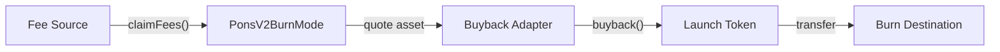
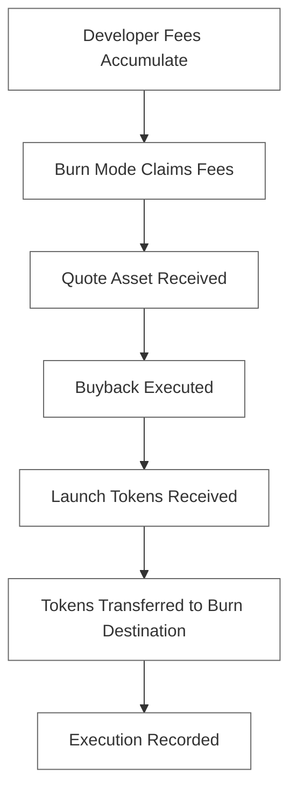
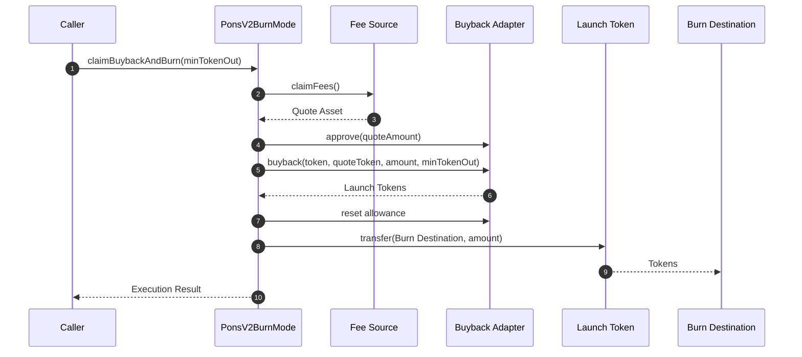
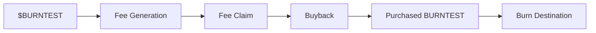
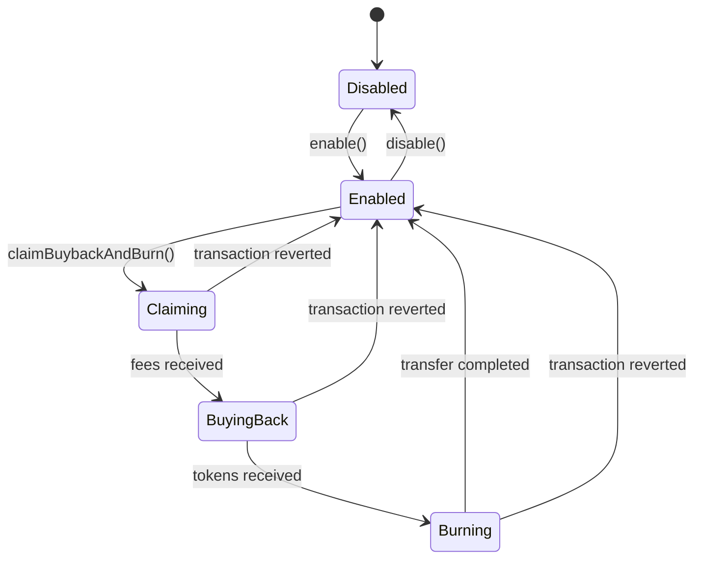
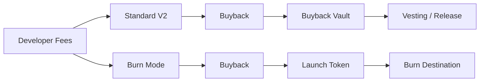

# Pons V2 — Burn Mode

<div align="center" style="margin-bottom: 3rem; animation: float 4s ease-in-out infinite;">
  
</div>

<div class="status-box">
  <div><strong>Reference asset:</strong> Burning Pons (<code>$BURNTEST</code>)</div>
</div>

## 1. Overview
Pons V2 Burn Mode is an experimental extension proposal for the Pons V2 economic architecture.
The mechanism introduces an alternative destination for developer fees generated by a launch.
Instead of allowing the resulting bought-back tokens to enter a conventional vesting or distribution mechanism, Burn Mode routes the economic flow toward a designated, immutable burn destination.

The complete lifecycle is:

```text
Developer Fees
      │
      ▼
Fee Claim
      │
      ▼
Quote Asset
      │
      ▼
Buyback
      │
      ▼
Launch Token
      │
      ▼
Immutable Burn Destination
```

The prototype is deliberately isolated from the existing production V2 contracts.
Its purpose is to establish and test the economic and technical primitives required for a potential native implementation.

## 2. Design Objective
The proposal is based on a single principle:

> Developer fees generated by a launch can be redirected into market buybacks whose acquired tokens are subsequently transferred to a predetermined permanent destination.

The contract therefore does not attempt to introduce a new pricing model.
It does not implement a new bonding curve.
It does not define liquidity.
It does not attempt to replace the existing Pons V2 execution architecture.
Instead, it defines a modular execution layer around three external responsibilities:



## 3. Protocol Lifecycle
The entire lifecycle can be represented as a deterministic pipeline.



Each stage is intentionally observable on-chain.

## 4. Execution Sequence
The following sequence illustrates a complete `claimBuybackAndBurn()` execution.



The entire operation is executed atomically. If any required operation reverts, the transaction is reverted.

## 5. Core Contract
The primary implementation is:

`PonsV2BurnMode.sol`

The contract acts as an orchestration layer rather than a replacement for the underlying fee and buyback infrastructure.

```text
                         PonsV2BurnMode
                               │
             ┌─────────────────┼─────────────────┐
             │                 │                 │
             ▼                 ▼                 ▼
        Fee Source        Buyback Router      Token
             │                 │                 │
             │                 │                 │
         claimFees()        buyback()        transfer()
```

The contract has four immutable protocol dependencies:

| Parameter | Description |
|-----------|-------------|
| `token` | Launch token that is purchased |
| `quoteToken` | Asset used to execute the buyback |
| `feeSource` | Contract from which developer fees are claimed |
| `buybackRouter` | Adapter responsible for executing the buyback |

The burn destination is additionally hard-coded into the implementation.

## 6. Burn Destination
The prototype uses a fixed burn destination: `0xDEAD83a9C5bCBaECe8300BEC83E85f25B2d0273F`

It is defined as:
```solidity
address public constant BURN_WALLET = 0xDEAD83a9C5bCBaECe8300BEC83E85f25B2d0273F;
```

The address is therefore part of the deployed contract's immutable logic. There is no administrative setter, governance setter, upgrade function capable of changing the destination, or token recovery path.

The relevant operation is:
```solidity
IERC20(token).safeTransfer(
    BURN_WALLET,
    amount
);
```

## 7. Why a Destination Wallet?
This prototype intentionally does not require the launch token to implement `ERC20Burnable`. The Burn Mode mechanism operates at the ERC-20 transfer layer. This makes the prototype compatible with ordinary ERC-20 tokens. The economic interpretation of the destination is that tokens sent there are outside the intended active circulation of the protocol.

## 8. Test Asset
**Burning Pons — `$BURNTEST`**

The prototype uses a dedicated test asset:
*   **Name:** Burning Pons
*   **Symbol:** BURNTEST
*   **Classification:** Test Token
*   **Purpose:** Burn Mode validation
*   **Production utility:** None

`$BURNTEST` exists to provide a concrete asset against which the proposal can be tested.



## 9. Fee Claiming
The fee source is abstracted through:
```solidity
interface IPonsBurnFeeSource {
    function claimFees() external returns (uint256 amount);
    function quoteToken() external view returns (address);
    function token() external view returns (address);
}
```

The controller measures the quote-token balance before and after the claim.
The resulting value is recorded in `totalFeesClaimed`.

## 10. Buyback Execution
The buyback mechanism is abstracted through `interface IPonsBurnBuybackRouter` which exposes `buyback` and `quoteBuyback`.
The Burn Mode controller does not define how the underlying market price is calculated.

## 11. Slippage Protection
Every buyback accepts a `minTokenOut` parameter. The transaction is considered valid only if `actualTokenOutput ≥ minTokenOut`, otherwise it REVERTs.

## 12. Allowance Management
Before a buyback, the controller grants the router the exact quote-token amount required:
```solidity
IERC20(quoteToken).forceApprove(buybackRouter, quoteAmount);
```
After execution, the allowance is reset to `0`.

## 13. Burn Execution
Once the buyback has completed, the controller determines the amount of launch tokens it holds and transfers them to the fixed burn destination.
```solidity
uint256 amount = IERC20(token).balanceOf(address(this));
IERC20(token).safeTransfer(BURN_WALLET, amount);
```

Protocol accounting is updated (`totalBurned += amount`, `executionCount += 1`), and an event is emitted.

## 14. Complete Pipeline
The primary convenience method is: `claimBuybackAndBurn(uint256 minTokenOut)`

```text
┌─────────────────────────────────────────────┐
│           claimBuybackAndBurn()             │
├─────────────────────────────────────────────┤
│  1. Verify Burn Mode is enabled             │
│  2. Record quote-token balance              │
│  3. Claim developer fees                    │
│  4. Determine actual fees received          │
│  5. Approve buyback adapter                  │
│  6. Execute buyback                          │
│  7. Verify minimum token output              │
│  8. Reset router allowance                   │
│  9. Determine purchased token balance        │
│ 10. Transfer tokens to burn destination      │
│ 11. Update protocol accounting               │
│ 12. Emit execution events                   │
└─────────────────────────────────────────────┘
```

## 15. State Model
Burn Mode can be understood as a finite execution state machine.



## 16. Accounting
The prototype exposes four principal accounting variables:
*   `totalFeesClaimed` - Cumulative quote asset received.
*   `totalQuoteSpent` - Cumulative quote asset used in buybacks.
*   `totalBurned` - Cumulative launch tokens transferred.
*   `executionCount` - Number of completed buyback-to-burn executions.

## 17. Events
The contract exposes explicit events for every major stage (`FeesClaimed`, `BuybackExecuted`, `TokensBurned`, `BuybackAndBurnExecuted`).

## 18. Access Control
The contract uses OpenZeppelin's `Ownable2Step`. The owner can enable or disable Burn Mode but cannot modify core configuration (`token`, `quoteToken`, `feeSource`, `buybackRouter`, `BURN_WALLET`) after deployment.

## 19. Reentrancy Protection
State-changing execution functions are protected with `nonReentrant`.

## 20. Failure Semantics
The complete pipeline is atomic. If the final transfer fails, the complete transaction reverts.

## 21. Contract Interface
| Function | Access | Purpose |
|----------|--------|---------|
| `enable()` | Owner | Enable Burn Mode |
| `disable()` | Owner | Disable Burn Mode |
| `claimFees()` | Public | Claim developer fees |
| `quoteBuyback()` | View | Estimate buyback output |
| `executeBuyback()` | Public | Execute buyback only |
| `burn()` | Public | Transfer held tokens to burn destination |
| `claimBuybackAndBurn()` | Public | Execute complete pipeline |

## 22. Separation of Responsibilities
The controller does not own the entire economic system. Each component has a distinct responsibility (Fee Source, Burn Mode, Buyback Adapter, Token, Burn Destination).

## 23. Standard V2 and Burn Mode


## 24 - 38. Additional Architectural Components
*Detailed sections spanning Test Environments, Test Sequences, Invariants, Security Considerations, Repository Structure, Deployment Configuration, and Implementation Status emphasize the robustness, modularity, and explicit separation of adapter boundaries for the $BURNTEST reference architecture.*

<br><br>
<div align="center" style="margin-top: 3rem; padding-top: 2rem; border-top: 1px solid #30363d;">
  <p style="color: #6e7681; font-size: 0.9rem;">
    <em>This contract is released under the license specified by the repository. For production deployment, independent security review and protocol-level integration testing are required.</em>
  </p>
</div>

</div>
